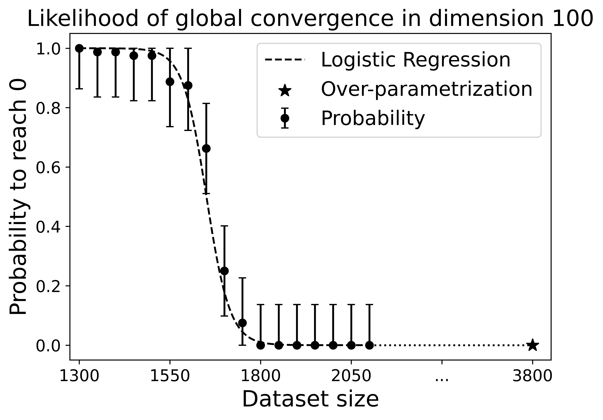
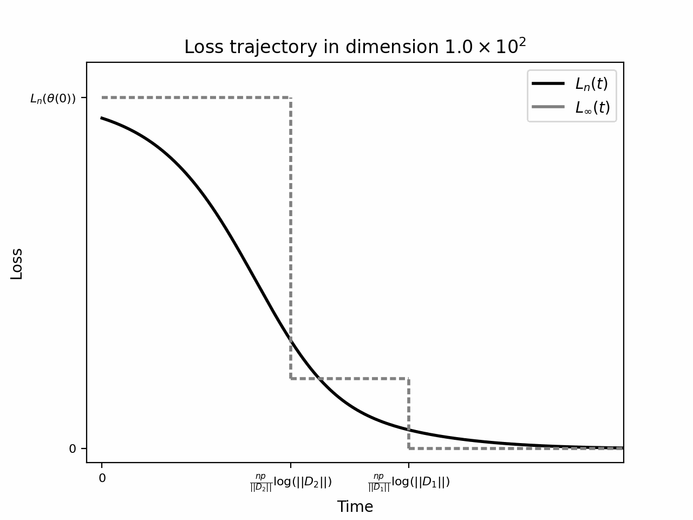

# Convergence-High-Dimension

**Code for:** *Convergence of Shallow ReLU Networks on Weakly Interacting Data*  
Léo Dana, Francis Bach, Loucas Pillaud-Vivien. —[arXiv:2502.16977](https://arxiv.org/abs/2502.16977).

---

## Summary

This repository contains code and notebooks used to reproduce the experiments and illustrations from the paper *“Convergence of Shallow ReLU Networks on Weakly Interacting Data”* (NeurIPS 2025). The paper analyses gradient-flow convergence of one-hidden-layer ReLU networks in high-dimensional regimes (low input correlations), and demonstrates conditions where a small width gives global convergence and characterizes convergence rates and a phase-transition phenomenon. See the paper for theory, proofs and detailed statements.

Repository snapshot (top-level files / notebooks):
- `model_data_train.py` — (script) utilities / experiments for training model(s) on generated data.
- `phase_transition.py` — (script) experiments / visualizations exploring the phase-transition in convergence speed.
- `utils.py` — helper functions (data generation, metrics, plotting, random seeds).
- `analysis.ipynb`, `exps.ipynb` — Jupyter notebooks with experiment runs, visualizations and analysis.
- `raw experiments/` — folder (likely contains saved outputs / images / data).

